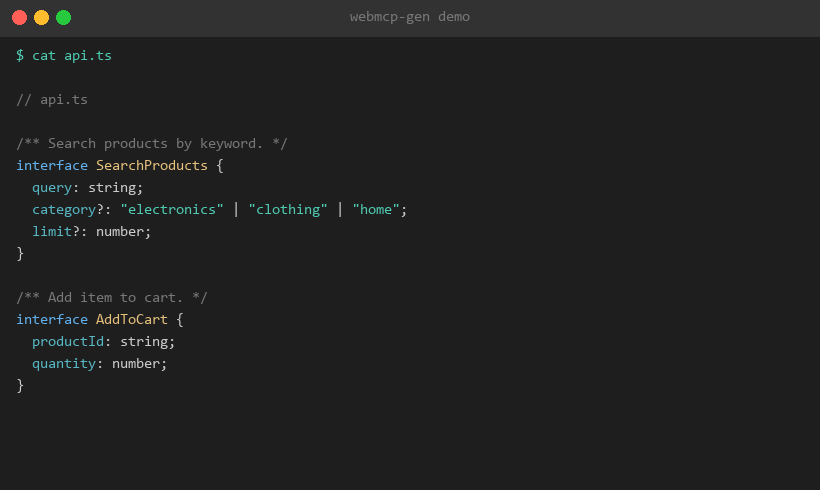

# webmcp-gen



CLI tool that generates [WebMCP](https://developer.chrome.com/docs/ai/webmcp) tool definitions from TypeScript interfaces.

WebMCP is the browser-native API (`navigator.modelContext`) that lets web pages expose structured tools to AI agents. It shipped as a Chrome 149 origin trial in June 2026. This tool reads your TypeScript interfaces and produces spec-compliant JSON tool definitions plus ready-to-use handler stubs.

> **Disclaimer:** This project is not affiliated with or endorsed by Google or the W3C.

> Built with AI assistance.

## Install

```bash
npm install -g webmcp-gen
```

Or use without installing:

```bash
npx webmcp-gen --api myapp.ts
```

## Quick start

**1. Write your API as TypeScript interfaces:**

```typescript
// api.ts

/** Search products by keyword. */
interface SearchProducts {
  /** The search query string. */
  query: string;
  /** Filter by category. */
  category?: "electronics" | "clothing" | "home";
  /** Max results (1-100). */
  limit?: number;
}

/** Add an item to the shopping cart. */
interface AddToCart {
  /** Product identifier. */
  productId: string;
  /** Quantity to add. */
  quantity: number;
}
```

**2. Generate WebMCP definitions:**

```bash
webmcp-gen --api api.ts
```

**3. Output** (in `webmcp-out/`):

```
webmcp-out/
  searchProducts.webmcp.json     # JSON tool definition
  searchProducts.handler.ts      # TypeScript handler stub
  addToCart.webmcp.json
  addToCart.handler.ts
```

The `.webmcp.json` files contain the tool definition ready for `navigator.modelContext.registerTool()`. The `.handler.ts` files contain the full registration call with a stub `execute` callback for you to implement.

## Usage

### Generate from TypeScript

```bash
# Default output to ./webmcp-out/
webmcp-gen --api myapp.ts

# Custom output directory
webmcp-gen --api myapp.ts -o generated/

# Single combined file instead of per-tool files
webmcp-gen --api myapp.ts --combined

# Validate only (no files written)
webmcp-gen --api myapp.ts --validate
```

### Example templates

```bash
# List available templates
webmcp-gen --list-templates

# Emit a template to the current directory
webmcp-gen --template crud-api

# Then generate from it
webmcp-gen --api crud-api.ts
```

Available templates:

| Template | Description |
|---|---|
| `crud-api` | CRUD operations (create, read, update, delete) |
| `search` | Search/filter with pagination and sorting |
| `form-handler` | Form submissions (contact, booking) |
| `data-transformer` | Data conversion and formatting tools |

## How it works

1. **Parse** -- Uses [ts-morph](https://github.com/dsherret/ts-morph) to read TypeScript interfaces and type aliases from your source file.
2. **Convert** -- Maps TypeScript types to JSON Schema: `string` -> `"string"`, `number` -> `"number"`, union literals -> `enum`, arrays -> `{ type: "array", items: ... }`, nested objects -> nested schemas.
3. **Annotate** -- Pulls descriptions from JSDoc comments. Detects `@readonly` tags and sets `annotations.readOnlyHint`.
4. **Validate** -- Checks every generated definition against the WebMCP spec: valid name, non-empty description, valid JSON Schema, no orphaned `required` entries.
5. **Output** -- Writes one `.webmcp.json` + one `.handler.ts` per tool (or a combined pair with `--combined`).

## Generated output format

### JSON definition (`*.webmcp.json`)

```json
{
  "name": "searchProducts",
  "description": "Search products by keyword.",
  "inputSchema": {
    "type": "object",
    "properties": {
      "query": {
        "type": "string",
        "description": "The search query string."
      },
      "category": {
        "type": "string",
        "enum": ["electronics", "clothing", "home"]
      },
      "limit": {
        "type": "number"
      }
    },
    "required": ["query"]
  },
  "annotations": {
    "readOnlyHint": true
  }
}
```

### Handler stub (`*.handler.ts`)

```typescript
// Chrome 149: navigator.modelContext — Chrome 150+: document.modelContext
const ctx = "modelContext" in document ? document.modelContext : navigator.modelContext;

ctx.registerTool({
  name: "searchProducts",
  description: "Search products by keyword.",
  inputSchema: { /* ... */ },
  annotations: { readOnlyHint: true },
  execute: async (input: SearchProductsInput): Promise<string> => {
    // TODO: Implement searchProducts logic here
    throw new Error("Not implemented: searchProducts");
  },
});
```

> **Note:** `navigator.modelContext` is deprecated in Chrome 150. Generated stubs include a compatibility shim that works across Chrome 149–156+.

## TypeScript mapping reference

| TypeScript | JSON Schema |
|---|---|
| `string` | `{ "type": "string" }` |
| `number` | `{ "type": "number" }` |
| `boolean` | `{ "type": "boolean" }` |
| `"a" \| "b" \| "c"` | `{ "type": "string", "enum": ["a", "b", "c"] }` |
| `string[]` | `{ "type": "array", "items": { "type": "string" } }` |
| `{ nested: string }` | `{ "type": "object", "properties": { "nested": ... } }` |
| `prop?: type` | Excluded from `required` array |
| `/** JSDoc */` | `"description"` field |
| `@readonly` tag | `annotations.readOnlyHint = true` |
| `@untrusted` tag | `annotations.untrustedContentHint = true` |

## Security

WebMCP allows AI agents to execute tools that affect live web applications. Google advises developers to follow these practices — `webmcp-gen` bakes them into the generated handler stubs automatically:

- **Human-in-the-loop for mutating actions.** Tools that aren't marked `@readonly` get a `requestUserInteraction()` reminder in their handler stub. Use this to confirm sensitive operations (purchases, deletions, account changes) before executing.
- **Input sanitisation.** Tools accepting freeform string inputs get a sanitisation reminder. WebMCP tool data may contain indirect prompt injection from contaminated tool responses or malicious manifests — validate and escape all inputs.
- **Read-only annotations.** Mark query/lookup interfaces with `@readonly` in JSDoc. The generator sets `annotations.readOnlyHint = true`, signalling to agents that the tool has no side effects.

See [Chrome's WebMCP security guidance](https://developer.chrome.com/docs/ai/webmcp) for full details.

## Programmatic API

```typescript
import { parseTypeScriptFile, generate, validateToolDefinition } from "webmcp-gen";

// Parse a file
const result = parseTypeScriptFile("./api.ts");
console.log(result.tools);

// Full pipeline
const output = generate({
  inputFile: "./api.ts",
  outDir: "./webmcp-out",
});

// Validate a definition
const validation = validateToolDefinition({
  name: "myTool",
  description: "Does something useful.",
  inputSchema: {
    type: "object",
    properties: { id: { type: "string" } },
    required: ["id"],
  },
});
```

## npm package note

The primary package name is `webmcp-gen`. The fallback name `untangled-webmcp` is reserved on npm as an alternative if needed.

## Changelog

### v1.2.0 — Security hardening

This release hardens code generation against injection and path traversal vectors found during an internal security audit. No exploitation in the wild is known. All users of v1.0.0–v1.1.1 should upgrade.

- Fixed: JSDoc comment injection via `*/` in descriptions
- Fixed: Unescaped newlines/CR in generated string literals
- Fixed: Tool names used as filenames without sanitisation (path traversal)
- Fixed: Files written before validation passed
- Added: `untrustedContentHint` annotation support (`@untrusted` JSDoc tag)
- Fixed: Boolean union types now get correct schema type
- Fixed: Null deref guard on properties with no declarations

### v1.1.0 — Chrome 150 compatibility

- Fixed: `navigator.modelContext` deprecated in Chrome 150; generated stubs now use a compat shim across Chrome 149–156+
- Added: `@untrusted` JSDoc tag for `untrustedContentHint` annotation
- Added: `Promise<string>` return type on execute callbacks

### v1.0.0 — Initial release

- TypeScript interface → WebMCP tool definition codegen
- 4 starter templates (CRUD, search, form handler, data transformer)
- JSON Schema validation against the WebMCP spec
- Security best practices in generated handler stubs

## Development

```bash
git clone https://github.com/oliuntangled/webmcp-gen.git
cd webmcp-gen
npm install
npm run build
npm test
```

## License

MIT
